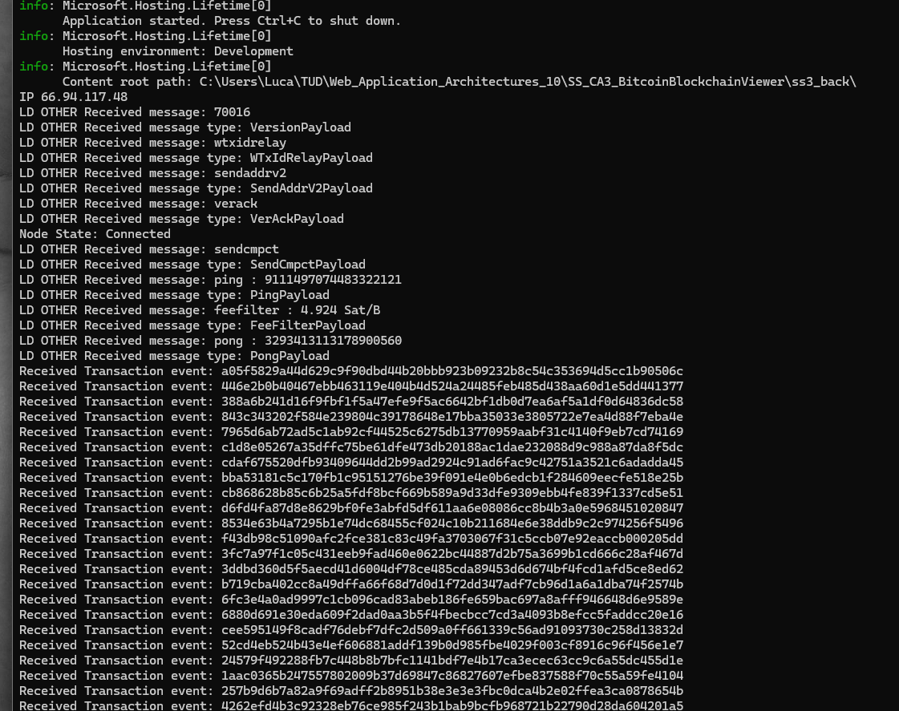

# CA3 Luca D'Angelo

1. **High Level Architecture**
    - Interaction Flow Diagram: 
    - Overview:
        - Back End
            - The back end was implemented utilizing ASP.NET Core API with SignalR for real-time communication and NBitcoin for interacting with the Bitcoin network. 
                1. SignalR (used for real-time web functionality, allowing server-side code to push content to connected clients instantly) is used by “BitcoinHub” for broadcasting Bitcoin events (transactions, blocks) to all connected clients. 
                2. NBitcoin (.NET framework library) was used for handling Bitcoin protocol interactions and blockchain operations. So connect to Bitcoin nodes, process blockchain data and handle Bitcoin protocols.
                3. Code is provided with summaries and descriptions.
            - Note: an option was to use a .NET Core console app, but I wanted to provide functionality to easily send cancellation tokens to the controller action when done with bitcoin observation.
            - References: 
                - https://dotnet.microsoft.com/en-us/apps/aspnet/signalr
                - https://metacosa.github.io/NBitcoin/api/ 
        - Front End
            - The front end was implemented using React. Main responsibility is to display the latest Bitcoin transactions and more importantly blocks of transactions in a user-friendly interface. Key parts are:
                1. State Management: this wraps managing of state for latest Bitcoin events, block queue, active tab, total pages for transactions, pagination status and expanded transactions.
                2. Event Handling: listens (in infinite loop until cancellation token) for new Bitcoin events (transactions and blocks) from the backend and updates the state accordingly.
                3. Tabs: Uses react-bootstrap Tabs to switch between "Blocks" and "Transactions" views. 
                4. Components: Renders BitcoinEvents, BlockDisplay, and TransactionDisplay components.
                5. Interaction with back end: “BitcoinEvents.js” component connects to the backend's SignalR hub at https://localhost:7057/bitcoinHub (static) to receive real-time updates on Bitcoin transactions and blocks. When events are received the latest block or transaction state gets updated. Then data parsing/massaging and UI rendering! Yes super mega cool.

2. **Code**
    - Summaries in code(key classes):
        1. Back End
            - NodeInfoController.cs
            - CreateBlockData.cs
            - ProcessRawTransactionData.cs
        2. Front End
            - App.js
            - CustomPagination.js
            - TransactionDisplay.js
            - BlockDisplay.js
            - BitcoinEvents.js

3. **Build and run the Application(including referenced dependencies)**

    - pull BE and FE from https://github.com/lucafilippodangelo/SS_CA3_BitcoinBlockchainViewer.git (you are collaborator)
    - run backend from terminal (sit in your local folder where solution file is(example "C:\Users\Luca\TUD\Web_Application_Architectures_10\SS_CA3_BitcoinBlockchainViewer\ss3_back>") -> dotnet build -> dotnet run)
      
      open in browswer "https://localhost:7057/swagger/index.html" -> click "get" -> click "try it out" -> click "Execute"
      
      transactions start to be received from node
      
      NOTE: depending on how busy the node is, transactiond may not be received. In that case please update IP in Back end
      

    - run front end (sit in your local folder where the root of the react solution is(example      "C:\Users\Luca\TUD\Web_Application_Architectures_10\SS_CA3_BitcoinBlockchainViewer\ss3_react\ss3-react-app") ->npm install -> npm start)
    
      - NOTE: if your front end does not run on port 3000 you need to update cors setup in backend, then rebuild. 
        

4. **How to use it. Screen shots and use cases**

    After executing step 3(building and running), open "http://localhost:3000" will be possible to see transactions starting to be rendered in transaction tab. The very last transaction received from Back end will be displayed in first row of the table. Open image in a new tab to see it fullsize.
    

    When a block is received it will be diplayed in "Blocks" tab of the web application.
    - In yellow, mapping of the block
    - In azure, example of mapping of a block transaction

    

    Some use cases around blocks:
    - In green, most recent block will be rendered at the top. At the moment UI keeps in browser memory info for last 3 blocks received. Example: when the forth is received the oldest is overriden. 
    - In Yellow, by clicking in a row transaction is possible to see transaction details. Payload is trimmed due to memory efficiency, at the moment the app is not using a DB.
    - In Blue, each block can be independently paginated by buttons up/down or by selecting the specific page from dropdown. 
        - the front end keeps memory of transactions for which details are displayed. As an example if in page 1 I click on row 3 to see transaction details, then I jump to page 3, then jump back on page one, page one will be rendered with details for row 3 expanded. Pretty cool I know :)

    

    It's possible to use multi browser, multi tabs. A web app was created on purpose, allow flexibility, use browser memory, and gain from bootstrap out of the box benefits when it comes of resizing, be mobile friendly etc..

    